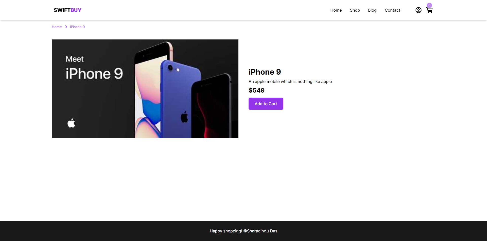
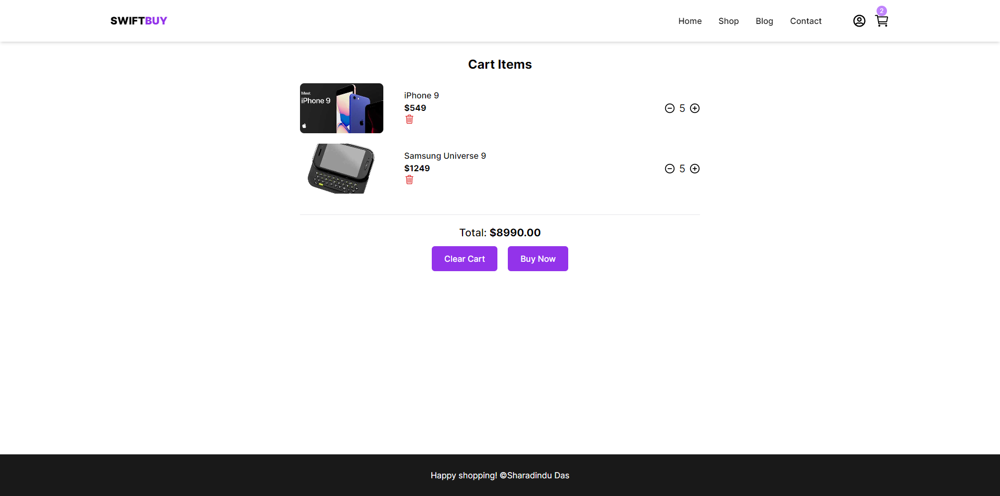
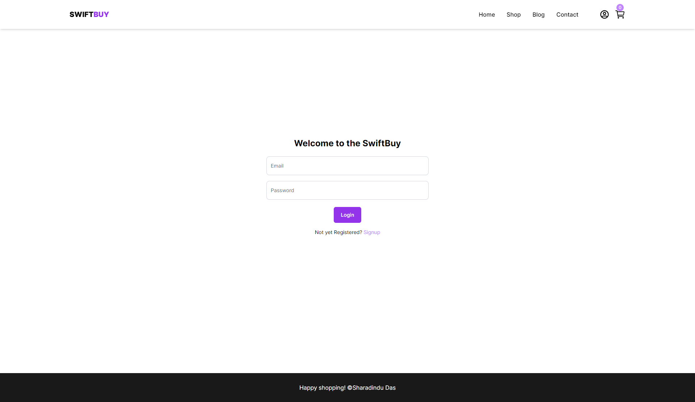
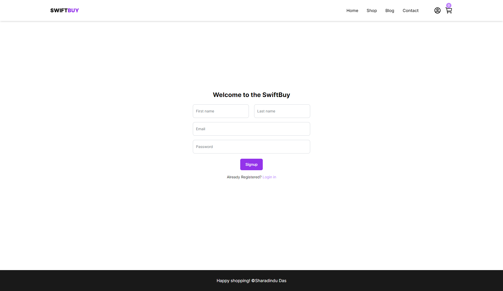
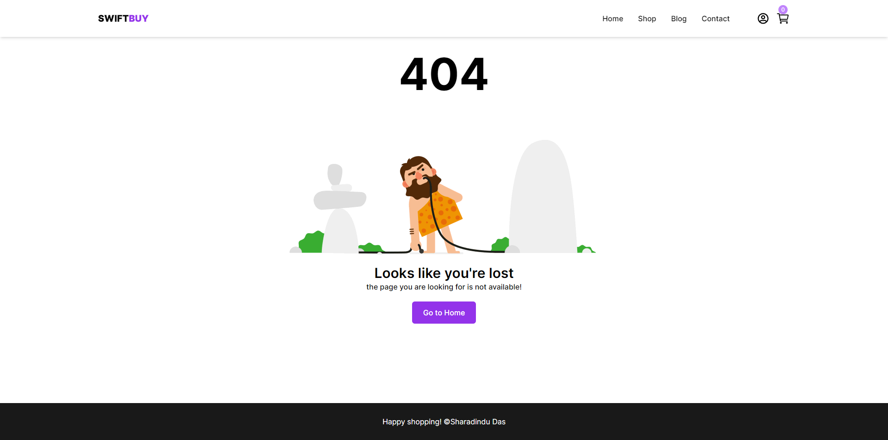

# SwiftBuy Ecommerce App

SwiftBuy is a modern e-commerce application built with Next.js 14, leveraging TypeScript for type safety, Tailwind CSS for styling, and Redux Toolkit with redux-persist for state management and persisting data. This application provides a seamless shopping experience with essential features such as product browsing, detailed product pages, a checkout system, and CRUD operations for cart management.

## Features

- **Home Page**: Browse a curated list of products fetched from a third-party API.
- **Product Details Page**: View detailed information about a selected product.
- **Checkout Page**: Review and manage items in your cart before completing the purchase.
- **Login and Signup Pages**: User interfaces for logging in and signing up (UI only for now).
- **Custom Error Page**: Friendly error page for handling application errors.
- **CRUD Operations**: Add items to the cart, update item quantities, delete items from the cart, and view the cart contents on the checkout page.
- **State Management**: Efficient state management using Redux Toolkit and persistent state with redux-persist.
- **Responsive Design**: Fully responsive and modern design implemented using Tailwind CSS.

## Technologies Used

- **Next.js 14**: Framework for building server-rendered React applications.
- **TypeScript**: Superset of JavaScript for type safety and improved development experience.
- **Tailwind CSS**: Utility-first CSS framework for rapid UI development.
- **Redux Toolkit**: State management solution for managing application state.
- **redux-persist**: Middleware to persist and rehydrate Redux store.

## Pages

### Home Page


### Product Details Page


### Checkout Page


### Checkout Page (Empty)


### Login Page


### Signup Page


### Custom Error Page


## Installation

To get started with SwiftBuy, follow these steps:

1. **Clone the repository**:
    ```bash
    git clone https://github.com/R3MODAS/SwiftBuy-Ecommerce-App.git
    cd SwiftBuy-Ecommerce-App
    ```

2. **Install dependencies**:
    ```bash
    npm install
    ```

3. **Run the development server**:
    ```bash
    npm run dev
    ```


5. Open [http://localhost:3000](http://localhost:3000) with your browser to see the result.

## Usage

### Adding an Item to the Cart

1. Browse products on the Home Page.
2. Click on a product to view its details.
3. Click the "Add to Cart" button to add the item to your cart.

### Updating Item Quantity

1. Navigate to the Checkout Page.
2. Adjust the quantity of items in your cart using the quantity selectors.

### Deleting an Item from the Cart

1. Navigate to the Checkout Page.
2. Click the "Remove" button next to the item you wish to delete.

### Viewing the Cart

1. Click on the cart icon to view your cart's contents at any time.
2. Navigate to the Checkout Page to review your items before purchase.

## Contributing

We welcome contributions from the community. If you'd like to contribute to SwiftBuy, please follow these steps:

1. **Fork the repository**.
2. **Create a new branch**:
    ```bash
    git checkout -b feature/your-feature-name
    ```
3. **Make your changes** and commit them:
    ```bash
    git commit -m 'Add some feature'
    ```
4. **Push to the branch**:
    ```bash
    git push origin feature/your-feature-name
    ```
5. **Create a new Pull Request**.

## License

This project is licensed under the MIT License. See the [LICENSE](LICENSE) file for details.

---
